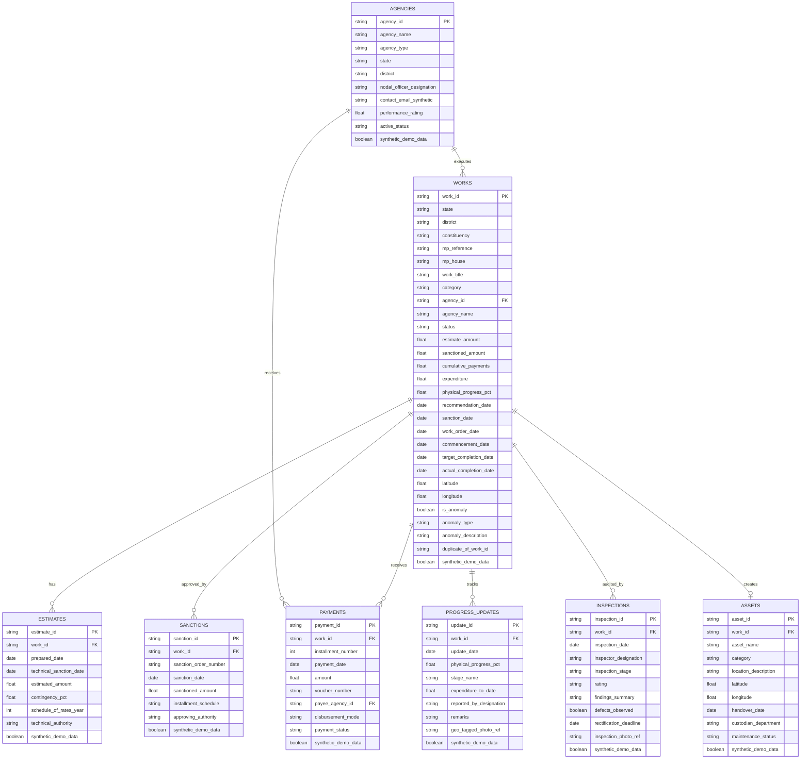

# MPLADS Demonstration Schema & Data Dictionary

> [!NOTE]
> **Synthetic Demonstration Data Notice**: All data described and generated under this schema is purely synthetic and intended strictly for application development, system testing, machine learning benchmarking, and UI demonstrations. No real personal, vendor, banking, Aadhaar, or confidential eSAKSHI data is used.

---

## 1. Relational Entity-Relationship Diagram

---

## 2. Standard Peer-Group Categories & Cost Benchmarks

To enable consistent cross-district peer-group comparison and anomaly detection, all works belong to one of 8 standardized categories:

| Category Name | Typical Scope | Median Estimate (INR) | Typical Duration |
| :--- | :--- | :--- | :--- |
| **Drinking Water** | RO plants, piped water schemes, deep borewells with solar pumps | ₹5,00,000 (₹5 Lakhs) | 120 days |
| **Education Infrastructure** | Smart classrooms, STEM labs, school toilet blocks, library halls | ₹15,00,000 (₹15 Lakhs) | 210 days |
| **Health & Sanitation** | Primary health sub-centres, bio-toilets, solid waste management units | ₹12,00,000 (₹12 Lakhs) | 180 days |
| **Roads, Pathways & Bridges** | Cement concrete roads, bitumen link roads, RCC box culverts | ₹25,00,000 (₹25 Lakhs) | 270 days |
| **Community Infrastructure & Halls** | Panchayat sabha bhawans, community halls, crematorium sheds | ₹20,00,000 (₹20 Lakhs) | 240 days |
| **Irrigation & Flood Control** | Check dams, percolation tanks, canal lining, flood protection walls | ₹18,00,000 (₹18 Lakhs) | 240 days |
| **Renewable & Solar Energy** | High-mast solar lights, micro-grids, solar agricultural pump systems | ₹8,00,000 (₹8 Lakhs) | 90 days |
| **Sports & Youth Development** | Outdoor stadiums, synthetic courts, open gyms, skill training centres | ₹14,00,000 (₹14 Lakhs) | 180 days |

---

### Indian Currency Conventions & Numbering Format
All financial fields (`estimate_amount`, `sanctioned_amount`, `cumulative_payments`, `expenditure`, `amount`) are stored as IEEE floating-point numbers representing **Indian National Rupees (INR / ₹)**.

- **Indian Comma Grouping**: Formatted as `₹ [Crores],[Lakhs],[Thousands],[Hundreds].[Paise]` (e.g., `₹ 1,85,00,000.00` = ₹1.85 Crore; `₹ 25,00,000.00` = ₹25 Lakh).
- **Accepted CSV Upload Notations**: The ingestion mapper automatically recognizes and converts Indian currency units:
  - `₹ 1.50 Crore` / `1.5 Cr` $\to$ `15000000.00`
  - `₹ 25 Lakhs` / `25 Lakh` / `25 Lacs` $\to$ `2500000.00`
  - `₹ 50 Thousand` / `50k` $\to$ `50000.00`
  - Standard grouped strings e.g. `₹ 15,00,000.00` / `Rs. 15,00,000` $\to$ `1500000.00`

---

---

## 3. Data Dictionary: Unified Demonstration Master Table (`clean_mplads_demo.csv` / `dirty_mplads_demo.csv`)

| Column Name | Data Type | Nullable | Description & Constraints | Validation Rules |
| :--- | :--- | :--- | :--- | :--- |
| `work_id` | String | No | Unique synthetic work code (`MPLAD-WRK-XXXXXX`). | Primary Key, non-empty, unique |
| `state` | String | No | Indian State name from master list. | Must match State Master list |
| `district` | String | No | District within the corresponding state. | Must belong to declared `state` |
| `constituency` | String | No | Parliamentary Constituency name. | Valid Lok Sabha/Rajya Sabha seat |
| `mp_reference` | String | No | Fictional MP identification code (`MP-LOK-DEMO-XXX`). | Synthetic string identifier |
| `mp_house` | String | No | Parliamentary House (`Lok Sabha (Demo)` / `Rajya Sabha (Demo)`). | Standard enum value |
| `work_title` | String | No | Full descriptive title of the developmental project. | Non-empty string |
| `category` | String | No | Sector category from standard list of 8 categories. | Must match standard category |
| `agency_id` | String | No | Implementing agency unique identifier (`AGY-SYNTH-XXXX`). | Foreign Key to Agency table |
| `agency_name` | String | No | Implementing agency organizational name. | Non-empty string |
| `status` | String | No | Lifecycle status (`Recommended`, `Sanctioned`, `Work Order Issued`, `In Progress`, `Completed`, `Stalled`). | Valid status enum |
| `estimate_amount` | Float | No | Initial technical estimate cost in Indian Rupees (INR). | Numeric $\ge 0.0$ |
| `sanctioned_amount` | Float | No | Administratively sanctioned cost in INR. | Numeric $\ge 0.0$ |
| `cumulative_payments` | Float | No | Cumulative funds disbursed to the implementing agency in INR. | Numeric $\ge 0.0$, $\le \text{sanctioned\_amount}$ |
| `expenditure` | Float | No | Actual audited expenditure incurred by agency in INR. | Numeric $\ge 0.0$, $\le \text{cumulative\_payments}$ |
| `physical_progress_pct` | Float | No | Percentage of physical completion achieved ($0.0 - 100.0\%$). | Numeric, $0.0 \le \text{val} \le 100.0$ |
| `recommendation_date` | Date | No | Date on which the MP recommended the work (`YYYY-MM-DD`). | ISO Date, $\le$ evaluation date |
| `sanction_date` | Date | Yes | Date on which administrative sanction was accorded. | $\ge \text{recommendation\_date}$ |
| `work_order_date` | Date | Yes | Date of work order/tender allotment to agency. | $\ge \text{sanction\_date}$ |
| `commencement_date` | Date | Yes | Date on which physical work commenced on site. | $\ge \text{work\_order\_date}$ |
| `target_completion_date` | Date | Yes | Stipulated completion deadline for the contractor. | $\ge \text{commencement\_date}$ |
| `actual_completion_date` | Date | Yes | Date on which work was formally completed. | Required if `status == 'Completed'` |
| `latitude` | Float | Yes | GPS Latitude of physical asset site ($6.0^\circ - 38.0^\circ\text{N}$). | Geographic bounding box |
| `longitude` | Float | Yes | GPS Longitude of physical asset site ($68.0^\circ - 98.0^\circ\text{E}$). | Geographic bounding box |
| `latest_inspection_date` | Date | Yes | Date of the most recent site inspection conducted. | ISO Date |
| `latest_inspection_rating` | String | Yes | Quality rating from inspection (`Satisfactory`, `Good`, `Requires Rectification`, etc.). | Standard rating enum |
| `latest_inspector_designation` | String | Yes | Professional designation of the site auditor. | Synthetic designation |
| `inspection_count` | Integer | No | Total number of formal site inspections conducted. | Integer $\ge 0$ |
| `payment_count` | Integer | No | Total number of installment vouchers disbursed. | Integer $\ge 0$ |
| `progress_update_count` | Integer | No | Total number of physical milestone reports filed. | Integer $\ge 0$ |
| `is_anomaly` | Boolean | No | Benchmark ground truth indicator for AI model evaluation. | True/False |
| `anomaly_type` | String | Yes | Type of injected demonstration scenario. | Ground-truth anomaly tag |
| `anomaly_description` | String | Yes | Human-readable explanation of injected behavior. | Neutral explanatory string |
| `duplicate_of_work_id` | String | Yes | Cross-reference `work_id` for duplicate work scenarios. | Valid `work_id` or None |
| `synthetic_demo_data` | Boolean | No | Mandatory metadata flag identifying synthetic demonstration data. | Must be `True` |

---

## 4. Ingestion Column Aliasing Dictionary

When uploading CSV data through backend endpoints, the ingestion pipeline automatically normalizes the following column header aliases:

| Internal Field Name | Accepted Ingestion Header Aliases |
| :--- | :--- |
| `work_id` | `work_id`, `work id`, `work_code`, `project_id`, `workid`, `id`, `work_number` |
| `state` | `state`, `state_name`, `state / ut`, `state_ut` |
| `district` | `district`, `district_name`, `dist_name`, `district / zilla` |
| `constituency` | `constituency`, `parliamentary_constituency`, `pc_name`, `constituency_name`, `ls_constituency` |
| `mp_reference` | `mp_reference`, `mp_name`, `mp_code`, `hon_mp_ref`, `mp_id`, `mp_ref` |
| `work_title` | `work_title`, `work_name`, `project_title`, `title`, `work_description`, `description` |
| `category` | `category`, `work_category`, `sector`, `head_of_development`, `work_type` |
| `agency_name` | `agency_name`, `implementing_agency`, `executing_agency`, `agency`, `contractor_agency` |
| `estimate_amount` | `estimate_amount`, `estimated_cost`, `estimate_cost`, `estimate (rs)`, `estimate_rs` |
| `sanctioned_amount` | `sanctioned_amount`, `sanction_amount`, `sanction_cost`, `sanctioned_cost`, `sanction (rs)` |
| `cumulative_payments` | `cumulative_payments`, `total_payments`, `payments_released`, `disbursed_amount`, `released_amount` |
| `physical_progress_pct` | `physical_progress_pct`, `physical_progress`, `progress_percentage`, `progress_%`, `progress` |
| `sanction_date` | `sanction_date`, `date_of_sanction`, `sanctioned_on`, `as_date` |
| `actual_completion_date`| `actual_completion_date`, `completion_date`, `date_of_completion`, `completed_on` |
| `latitude` | `latitude`, `lat`, `geo_lat`, `gps_latitude`, `y_coord` |
| `longitude` | `longitude`, `lon`, `long`, `geo_lon`, `gps_longitude`, `x_coord` |
